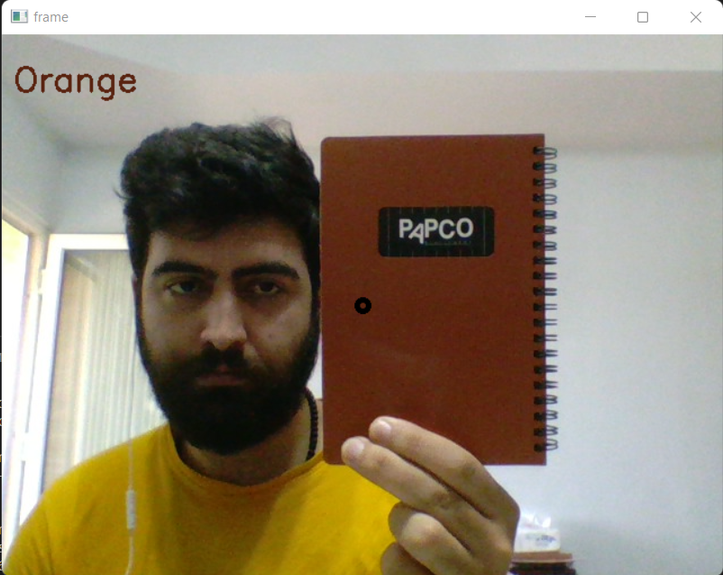

# Color Recognition for Fun :smiley:
You can run this project and detect colors of anythings in realtime.

## OpenCV
I used OpenCV library for this. You can install it like below:
```
$ pip install opencv-python
```

##  :computer: Result



